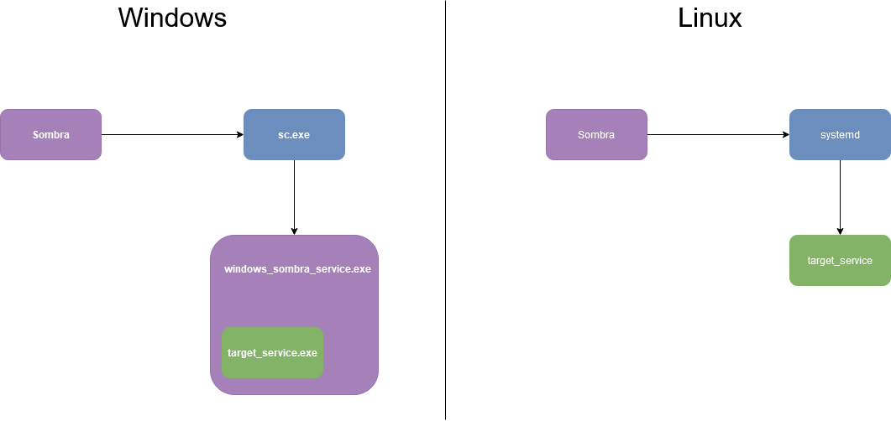

# sombra-rs

<p align="center">
  Uma biblioteca para criar e gerenciar serviços, que rodam em _background_, em diversas plataformas
</p>

<p align="center">
  <a href="#visao-geral">Visão Geral</a> •
  <a href="#como-usar">Como Usar</a> •
  <a href="#plataformas">Plataformas</a> •
  <a href="#objetivos-do-projeto">Objetivos do Projeto</a><br>
<p>

# Visão Geral

<br>

# Como Usar

Cria um serviço, em background:
```bash
# windows
sombra.exe create tcp_echo executables/tcp_echo.exe
# linux
sombra create tcp_echo executables/tcp_echo
```

Cria um serviço com parametros, em background:
```bash
# windows
sombra.exe create tcp_echo2 executables/tcp_echo.exe -p 30200
#linux
sombra create tcp_echo2 executables/tcp_echo -p 30200
```

Deleta um serviço, em background (criado utilizando Sombra)
```bash
# windows
sombra.exe delete tcp_echo
#linux
sombra delete tcp_echo
```

Executa um _script_ Python, como um serviço, em background (Nessa versão, o interpretador Python e o arquivo em Python devem possuir o caminho absoluto)
```bash
# windows
sombra.exe create python_service 'C:\Program Files\Python37\python.exe' C:\Users\<username>\Documents\tcp_echo.py
# linux
sombra create /usr/bin/python3 /home/<username>/tcp_echo.py
```

# Plataformas
- ✅ Windows 10
- ✅ Linux
- ❌ MacOS

## Configurações no Windows 10
Um executável especial (`sombra-windows-service.exe`) é necessário para executar o programa `sombra.exe`, na plataforma windows.
O executável `sombra-windows-service.exe` encapsula o processo alvo em um serviço do windows.
Esse repositório contém o executável especial, no diretório `executables`.

Antes de executar o programa `sombra.exe`, defina a variável de ambiente `SOMBRA_WINDOWS_SERVICE_PATH` como o caminho absoluto para o executável `sombra-windows-service.exe`.
Outro requisito é executar o programa `sombra.exe` em um terminal como administrador.

## Objetivos do Projeto
- Uma interface, muitas plataformas
- Biblioteca (Rust) e Executável
- no-panic
- Interferencia mínima nos gerenciadores de serviços nativos
